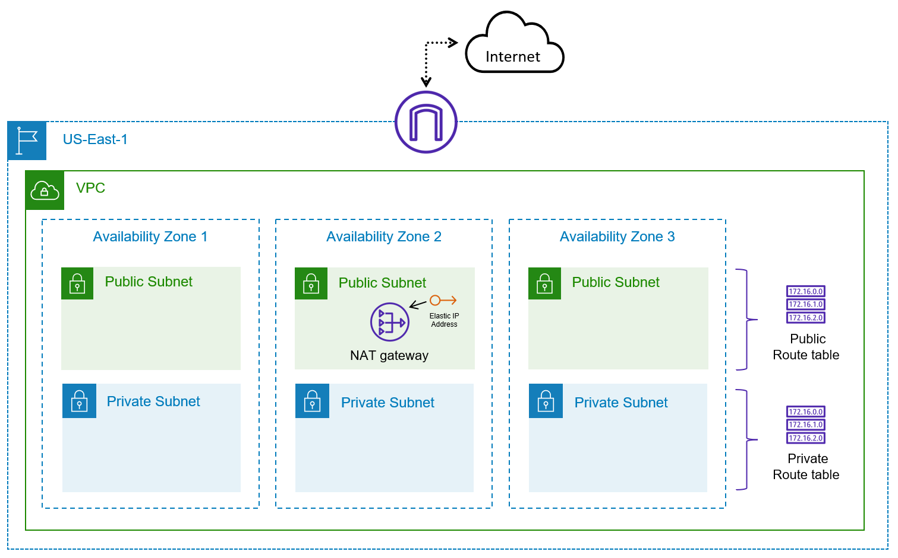

# Benefits of Infrastructure as Code

## Overview

This lesson demonstrates the practical benefits of Infrastructure as Code (IaC) by comparing manual AWS resource provisioning with Terraform automation. The lab showcases how IaC simplifies cloud adoption, eliminates manual processes, and enables scalable infrastructure management.

## Architecture



## Concepts

- **Manual vs. Automated Provisioning**: Comparison between console-based and code-based infrastructure deployment
- **Scalability**: Ability to replicate infrastructure across multiple environments and regions
- **Consistency**: Standardized deployments that reduce human error and configuration drift
- **Reusability**: Write-once, deploy-many approach to infrastructure management

## Key Benefits of Infrastructure as Code

### Simplification of Cloud Adoption

- **Rapid Service Integration**: Quickly adopt cloud-based services and offerings
- **Capability Enhancement**: Improve organizational capabilities through automation
- **Learning Curve Management**: Focus on platform understanding rather than repetitive tasks

### Automation and Efficiency

- **Manual Process Elimination**: Remove ticket-based infrastructure requests
- **Queue Reduction**: Eliminate waiting times for infrastructure provisioning
- **Error Minimization**: Reduce human mistakes in configuration and deployment

### Self-Service Capabilities

- **Developer Empowerment**: Enable developers to provision infrastructure independently
- **Service Library**: Provide standardized infrastructure components for consumption
- **Requirement Matching**: Allow infrastructure provisioning that matches application needs

### Standardization and Consistency

- **Organizational Standards**: Drive consistency across all infrastructure deployments
- **Efficiency Gains**: Reduce time and effort through standardized processes
- **Deviation Prevention**: Minimize errors and deviations from established norms

## Terraform Workflow

### Manual Process Comparison

**Manual AWS Console Steps:**

1. Navigate to VPC console
2. Create VPC with CIDR block
3. Create multiple subnets across availability zones
4. Configure route tables
5. Associate subnets with route tables
6. Create Internet Gateway
7. Attach Internet Gateway to VPC
8. Create NAT Gateway with Elastic IP
9. Configure routing rules

**Time Investment:** 15-30 minutes per environment
**Scalability:** Limited to one operator, one console session
**Error Prone:** Manual typing, clicking, configuration mistakes

### Terraform Automation

```hcl
# Variables Configuration
variable "aws_region" {
  type    = string
  default = "us-east-1"
}

variable "vpc_cidr" {
  type    = string
  default = "10.0.0.0/16"
}

variable "private_subnets" {
  default = {
    "private_subnet_1" = 1
    "private_subnet_2" = 2
    "private_subnet_3" = 3
  }
}
```

**Line-by-line Comments:**

```hcl
# Define AWS region for resource deployment
# Set VPC CIDR block for network addressing
# Map private subnet names to availability zone indices
```

```hcl
# Main Infrastructure Configuration
provider "aws" {
  region = var.aws_region
}

data "aws_availability_zones" "available" {}

resource "aws_vpc" "vpc" {
  cidr_block = var.vpc_cidr
  tags = {
    Name        = var.vpc_name
    Environment = "demo_environment"
    Terraform   = "true"
  }
}

resource "aws_subnet" "private_subnets" {
  for_each          = var.private_subnets
  vpc_id            = aws_vpc.vpc.id
  cidr_block        = cidrsubnet(var.vpc_cidr, 8, each.value)
  availability_zone = tolist(data.aws_availability_zones.available.names)[each.value]

  tags = {
    Name      = each.key
    Terraform = "true"
  }
}
```

**Line-by-line Comments:**

```hcl
# Configure AWS provider with specified region
# Retrieve available availability zones dynamically
# Create VPC with specified CIDR and tags
# Use for_each to create multiple private subnets
# Calculate subnet CIDR blocks automatically
# Distribute subnets across availability zones
# Apply consistent tagging strategy
```

### Code Walkthrough

The Terraform configuration uses several advanced features:

- **Data Sources**: Dynamically retrieve availability zones for the current region
- **For Each Loops**: Create multiple similar resources efficiently
- **CIDR Functions**: Automatically calculate subnet addressing
- **Resource Dependencies**: Implicit dependency management between resources
- **Variable System**: Parameterized configuration for reusability

**Deployment Time:** 14-16 seconds for complete infrastructure
**Scalability:** Unlimited parallel deployments across regions/accounts
**Consistency:** Identical infrastructure every deployment

## State Management

### Terraform State Benefits

- **Resource Tracking**: Maintains inventory of deployed infrastructure
- **Dependency Management**: Understands resource relationships and deletion order
- **Change Detection**: Identifies configuration drift and required updates
- **Cleanup Automation**: Ensures complete resource removal with `terraform destroy`

## Modules & Variables

### Reusability Patterns

- **Variable-Driven Deployment**: Change region by updating single variable
- **Environment Promotion**: Deploy identical infrastructure across dev/staging/production
- **Multi-Region Strategy**: Replicate infrastructure across geographic locations

```bash
# Region Change Example
terraform apply -var="aws_region=us-west-2"
```

**Line-by-line Comments:**

```bash
# Deploy same infrastructure to different region using variable override
```

## Pitfalls & Best Practices

### Manual Process Limitations

- **Human Error**: Typos in subnet names, CIDR blocks, or security configurations
- **Scaling Constraints**: One operator, one console session at a time
- **Inconsistency Risk**: Variations between deployments across environments
- **Documentation Lag**: Manual processes often lack current documentation

### Terraform Advantages

- **Idempotent Operations**: Same result regardless of execution frequency
- **Predictable Changes**: Preview modifications before application
- **Version Control**: Track infrastructure changes over time
- **Collaboration**: Multiple team members can work with same configuration

### Cost Management

- **Resource Awareness**: NAT Gateways incur charges (~$45/month)
- **Cleanup Automation**: `terraform destroy` ensures complete resource removal
- **Resource Optimization**: Code review can identify cost-saving opportunities

## Key Terms & Definitions

- **Idempotent**: Operations that produce the same result when executed multiple times
- **Configuration Drift**: Unplanned changes to infrastructure after initial deployment
- **Self-Service**: Capability for users to provision resources without operator intervention
- **Technical Debt**: Accumulated shortcuts or suboptimal configurations that impact future work

## Common Exam Traps

- **Manual vs. Automated Benefits**: Understanding specific advantages of IaC over manual processes
- **Scalability Concepts**: Recognizing how IaC enables organizational scaling
- **Consistency Requirements**: Importance of standardization across environments
- **Resource Dependencies**: Understanding how Terraform manages resource relationships

## References

- [Infrastructure as Code in a Private or Public Cloud](https://www.hashicorp.com/blog/infrastructure-as-code-in-a-private-or-public-cloud)

---

### Updated Information (as of 2024)

- **AWS Console Interface**: Updated screenshots and navigation paths to reflect current AWS console design
- **Terraform Syntax**: Confirmed compatibility with Terraform 1.0+ syntax and best practices
- **Cost Considerations**: Updated NAT Gateway pricing estimates and cost optimization strategies
